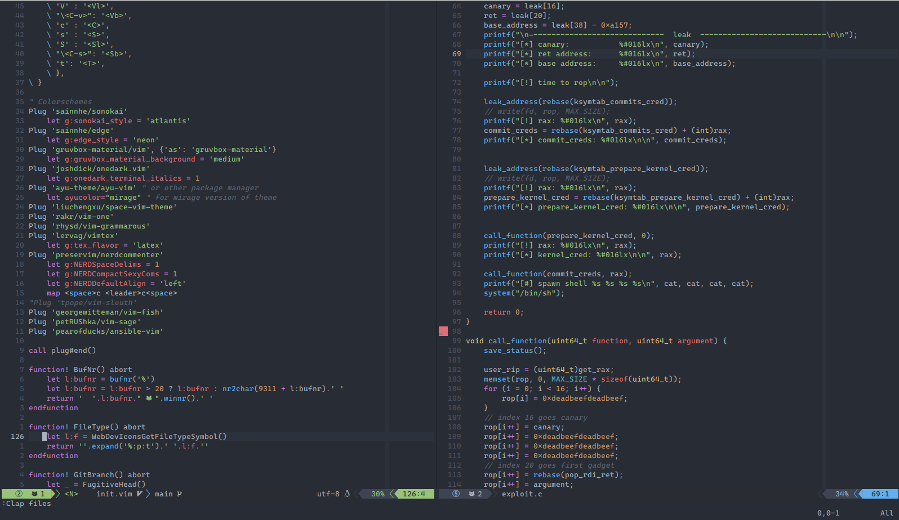

# Neovim config



## Important plugins

The most important plugins I use are [coc.nvim](https://github.com/neoclide/coc.nvim),
[vim-clap](https://github.com/liuchengxu/vim-clap) and [vim-multiple-cursors](https://github.com/terryma/vim-multiple-cursors)

### General custom shortcuts

```
<C-K> <C-J> <C-H> <C-L> -> Resize panes.
<space>v -> Open vertical terminal.
<space>x -> Open horizontal terminal.
```

#### Vim Clap

```
<space>y -> Paste precedent yanked lines.
<space>f -> Move between files inside the project and use.
<space>e -> Move between files inside the filesystem.
```

We can open the files inside vim-clap in various mode:

```
<C-V> -> Open file vertically.
<C-X> -> Open file horizontally.
<C-T> -> Open file in new tab.
```

#### Coc 

```
<space>cc -> Open Coc Config file.
<leader>rn -> Rename variable.
<leader>f -> Format the file.
K -> open documentation of the function under the cursor.
```

### C/C++ Setup

I usually do `ctags -R .` inside the root of the project. In this way I can move
inside the source code with:

```
<space>t -> Show tags specific of the current file.
<space>p -> Show tags of the whole project.
<space>s -> Select with visual line of the code's current block inside brackets.
<C-]> -> Open new buffer with the tag under the cursor.
<C-T> -> Go back from the tag opened.
```

With coc I recommend the coc-clangd extension, specifically with [Bear](https://github.com/rizsotto/Bear)
to generate the `compile_commands.json`.
In this way is possible to have the intellisense and autocompletion.

### Python

The keybindings I have are:

```
1. <F2> -> Rename a variable.
2. <space>cpe -> Run current file in terminal.
3. <space>cps -> Run current visual selection in terminal.
4. <space>cpl -> Enable/Disable linting.
```

